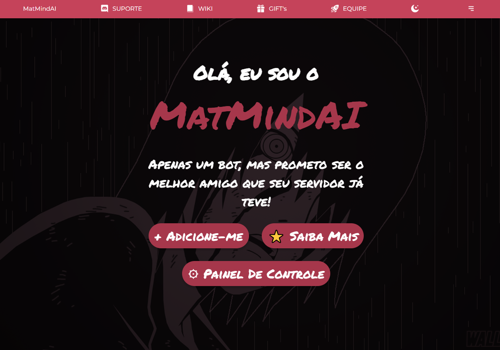

# 📑 MatMindAI - Site de Apresentação

Bem-vindo ao repositório do **MatMindAI**, um site de apresentação moderno e animado para um bot fictício chamado MatMindAI. Este projeto foi desenvolvido com HTML e CSS, utilizando animações suaves e design responsivo.

 <!-- Adicione uma imagem de preview se possível -->

# 🚀 Como Executar o Projeto

Siga os passos abaixo para rodar o projeto localmente:

1. **Clone o repositório**:
   ```bash
   git clone https://github.com/mateus-henriquee/site-bot
   ```

2. **Navegue até a pasta do projeto**:
   ```bash
   cd site-bot
   ```

3. **Abra o arquivo nó código**:
   ```bash
   code .
   ```

4. **Abra o arquivo `index.html`**:
   - Basta abrir o arquivo `index.html` no seu navegador favorito.

# 🛠 Tecnologias Utilizadas

- **HTML**: Estrutura do site.
- **CSS**: Estilização e animações.
- **Google Fonts**: Fonte `Permanent Marker` para o design do texto.
- **Flexbox**: Layout responsivo e alinhamento dos elementos.

# ✨ Funcionalidades

- **Animação de Entrada**: Os elementos de texto (`h1`, `span` e `p`) aparecem sequencialmente com uma animação de deslize da direita para a esquerda.
- **Botões Interativos**: Três botões estilizados com animações modernas ao passar o mouse.
  - Dois botões na parte superior e um abaixo.
  - Efeito de "entortar" para a direita ao interagir.
- **Design Responsivo**: Layout adaptável para diferentes tamanhos de tela.

# 🎨 Personalização

Você pode personalizar o site alterando os seguintes arquivos:

- **`index.html`**: Modifique o conteúdo do site.
- **`style.css`**: Altere as cores, animações e estilos.

# 🤝 Como Contribuir

Contribuições são bem-vindas! Siga os passos abaixo:

1. Faça um **fork** do projeto.
2. Crie uma nova branch com sua feature ou correção:
   ```bash
   git checkout -b minha-feature
   ```
3. Faça commit das suas alterações:
   ```bash
   git commit -m "Adicionei uma nova feature"
   ```
4. Envie para o repositório remoto:
   ```bash
   git push origin minha-feature
   ```
5. Abra um **Pull Request** no GitHub.

# 📄 Licença

Este projeto está sob a licença MIT. Veja o arquivo [LICENSE](LICENSE) para mais detalhes.

---

Feito com ❤️ por [Mateus Henrique](https://github.com/mateus-henriquee)
